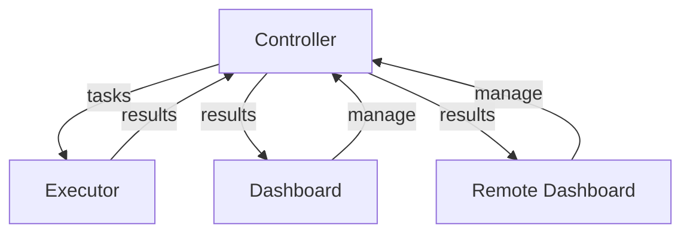
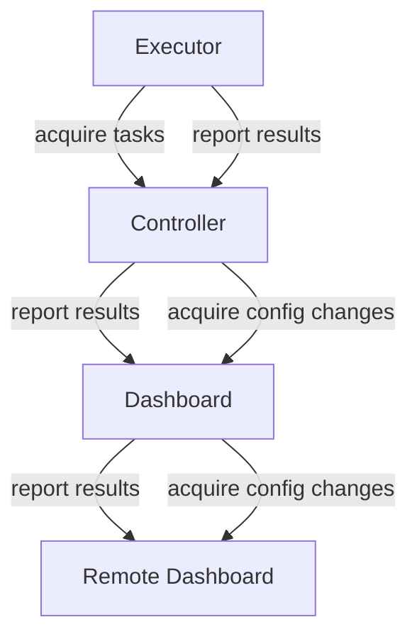

# NOF - Network Operator Framework

NOF is a framework for building network operator systems. It provides a set of tools and models
to help you build your own network operator system.

# Architecture

NOF consists of four main components:

- **Controller**: Central system for coordination of tasks and holding all data
- **Executor**: Acquires tasks from the controller, executes them and reports back
- **Dashboard**: Web interface for managing the controller
- **Remote Dashboard**: Remote web interface for managing multiple controllers

The general architecture looks like this:



Yet due to the restricted nature of common network systems, the NOF is designed to initiated communication
unidirectional from the Executor to the Controller, from the Controller to the Dashboard and from
the Dashboard to the Remote Dashboard. Hence the communication architecture looks like this:



# System Components

## Controller

The central system component to coordinate the system.

### Jobs

The Controller is responsible for managing the jobs that are assigned to the Executors.
These jobs are derived from the Tasks, which create a relation between TaskTemplates
and elements (e.g. Hosts).

## Executor

The Executor is responsible for executing the jobs that are assigned to it.

## Shell Task

A Shell Task is a pure command line educated task.

| Property | Type    | Description |
|----------|---------|-------------|
| cmd      | String  | Command to execute |
| template | String  | Template to use for the command |
| pattern  | String  | Pattern to use for the command |
| interval | Integer | Interval to use for the command |

### Example

The following example executes the command `echo "Hello, World!"` every 10 seconds
and captures the `Hello` from the output. Afterwards it formats the output
into a JSON object with the key `greeting` and the value `Hello`.

```json
{
  "cmd": "echo 'Hello, World!'",
  "template": "(?<greeting>Hello)",
  "pattern": "{ 'greeting': '#{greeting}' }",
  "interval": 10
}
```

## Dashboard

The Dashboard is a web interface for managing a single Controller.

## Remote Dashboard

The Remote Dashboard is a web interface for managing multiple Controllers.
It behaves as a superset of the Dashboard and allows you to manage multiple
Controllers from a single interface.

# Data Structures

## Host

A Host is a physical or virtual device in the system.

| Property  | Type   | Description |
|-----------|--------|-------------|
| uuid      | UUID   | Unique identifier for the host |
| hostname  | String | Human-readable name of the host |
| ip        | String | IP address of the host |

## TaskTemplate

A TaskTemplate describes a task that can be executed.

| Property  | Type   | Description |
|-----------|--------|-------------|
| uuid      | UUID   | Unique identifier for the task template |
| type      | String | Type of the task template (e.g. "shell") |
| opts      | JSON   | Options for the task template (e.g. command, interval, etc. for shell tasks) |

## Task / Job

A Task is an assignment of a `TaskTemplate` to a `Host`.
A job is a task that is assigned to an executor.

| Property          | Type | Description |
|-------------------|------|-------------|
| uuid              | UUID | Unique identifier for the task |
| host_uuid         | UUID | UUID of the host this task belongs to |
| tasktempalte_uuid | UUID | UUID of the task template this task is based on |

## Activities

Activities are a special kind of meta data model.
It is used to track the history of the system.
The system can be changed at different places and via activities we track and
sync the changes.

| Property    | Type      | Description |
|-------------|-----------|-------------|
| uuid        | UUID      | Unique identifier for the activity |
| created_at  | Timestamp | When the activity was created |
| action      | String    | Action to be performed |
| opts        | JSON      | Options for the activity |
| source_name | String    | Name of the source of the activity |
