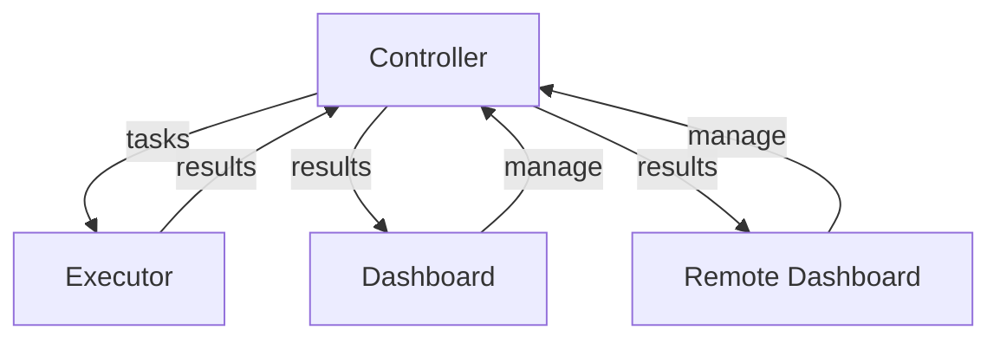
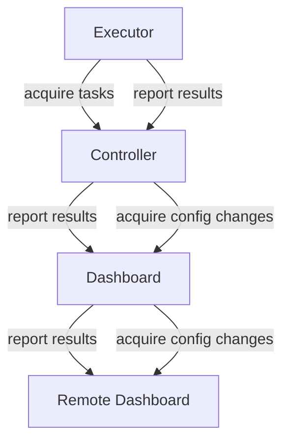

# NOF - Network Operator Framework

NOF is a framework for building network operator systems. It provides a set of tools and models
to help you build your own network operator system.

# Architecture

NOF consists of four main components:

- **Controller**: Central system for coordination of tasks and holding all data
- **Executor**: Acquires tasks from the controller, executes them and reports back
- **Dashboard**: Web interface for managing the controller
- **Remote Dashboard**: Remote web interface for managing multiple controllers

The general architecture looks like this:

Yet due to the restricted nature of common network systems, the NOF is designed to initiated communication
unidirectional from the Executor to the Controller, from the Controller to the Dashboard and from
the Dashboard to the Remote Dashboard. Hence the communication architecture looks like this:

# System Components

## Controller

### Jobs

The Controller is responsible for managing the jobs that are assigned to the Executors.
These jobs are derived from the Tasks, which create a relation between TaskTemplates
and elements (e.g. Hosts).

## Executor

## Dashboard

## Remote Dashboard
