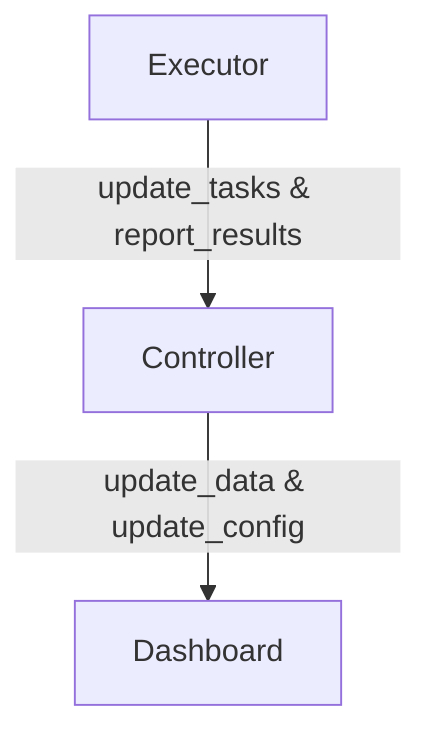

# NOF - Network Operator Framework

## Connectivity Requirements

The Controller needs to be able to reach the Dashboard to update data and acquire configuration changes. The Executor needs to be able to reach the Controller to acquire tasks. For a hybrid deployment the Dashboard needs
to be able to reach the remote Dashboard.

## Communication Details

Who is exchanging what data? Who is establishing the connection?

### Executor to Controller

The Executor is responsible to establish the connection to the Controller. The Executor will send a request to the Controller to acquire tasks. The Controller will respond with a list of tasks to be executed.

#### update_tasks

| Endpoint   | Data Format                                                                             |
|------------|-----------------------------------------------------------------------------------------|
| /tasks     | { tasks: [ { "command": "ls", "schedule": 20, "type": "shell", "uuid": "..." }, ... ] } |

#### report_results

| Endpoint   | Data Format                                            |
|------------|--------------------------------------------------------|
| /report    | { "uuid":"...", "result": "...", timestamp: 123456 }   |

### Controller to Dashboard

The Controller is responsible to establish the connection to the Dashboard. The Controller will send a request to the Dashboard to update data and acquire configuration changes. The Dashboard will respond with the updated data and configuration changes.

#### update_data

#### update_config