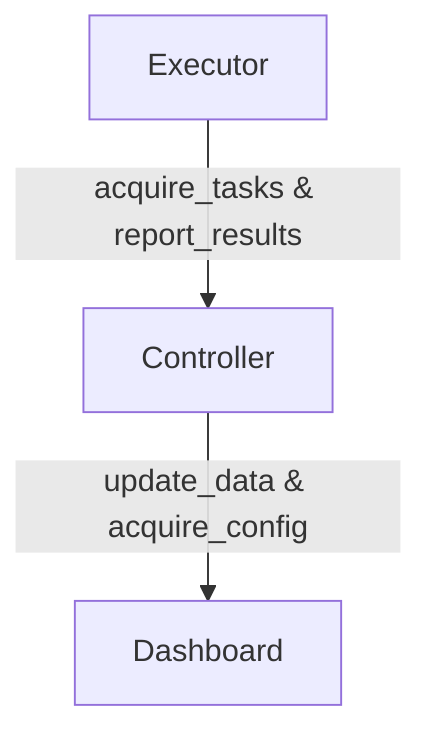

# NOF - Network Operator Framework

## Connectivity Requirements

The Controller needs to be able to reach the Dashboard to update data and acquire configuration changes. The Executor needs to be able to reach the Controller to acquire tasks. For a hybrid deployment the Dashboard needs
to be able to reach the remote Dashboard.