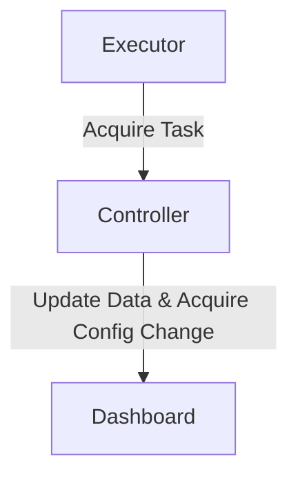

# NOF

```mermaid
graph TD;
  Controller["Controller"];
    Dashboard["Dashboard"];
    Executor["Executor"];

    Controller -->|Update Data & Acquire Config Change| Dashboard;
    Executor -->|Acquire Task| Controller;
```